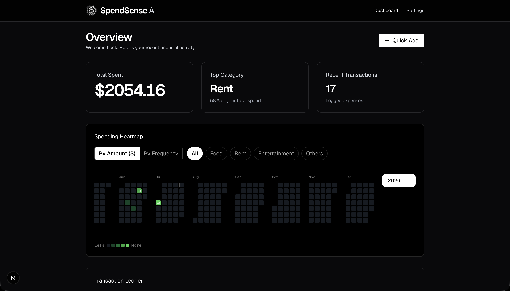

# SpendSense AI

[](https://github.com/negikshitiz/SpendSenseAI/actions/workflows/ci.yml)

> A personal finance tracker with receipt OCR, spending heatmaps, and session-based auth. Benchmarked, tested, and containerized.



---

## What It Does

- **Log expenses** manually or via receipt photo (OCR pipeline using OpenCV + Tesseract). The pipeline extracts the total amount, vendor, and date from the image. This data pre-fills the expense form for user confirmation before saving.
- **Spending heatmap** — GitHub-style calendar showing daily spend intensity
- **Monthly summaries** — category breakdown, running totals, currency-aware
- **Secure auth** — bcrypt sessions, HttpOnly cookies, rate-limited endpoints
- **Fully local** — SQLite on disk, no cloud database, no external services required

---

## Tech Decisions & Why

### SQLite over PostgreSQL

SpendSense is a single-user personal finance tool. The right database is the simplest one that handles the load. SQLite delivers **31,000 write ops/sec** (autocommit) and **0.002ms session lookups** — and eliminates an entire class of ops problems (connection pooling, credentials rotation, network latency). The benchmarks below confirm this was the right call.

If the app ever went multi-tenant, migrating to PostgreSQL is a well-defined operation. Premature PostgreSQL is just unnecessary infrastructure.

### bcrypt cost=12 (~250ms) — Intentional

Every `POST /api/auth/login` call triggers a full `bcrypt.compare()` at cost factor 12. This takes ~250ms on purpose. Cost 12 is the OWASP 2024 recommendation — it limits an attacker with a stolen hash database to ~3 GPU guesses/second.

The rate limiter (5 attempts/min/IP) is the first line of defence. bcrypt is the last. Neither alone is sufficient.

```typescript
// src/api/controllers/auth/register.ts
const BCRYPT_ROUNDS = 12;  // ← intentional security overhead — do not lower
```

### Rate Limiting Design (and its limits)

Auth endpoints use an in-memory sliding-window counter:
- `POST /api/auth/login` — 5 attempts / IP / minute
- `POST /api/auth/register` — 3 attempts / IP / minute

**Known limitations** (documented explicitly in [`rate-limit.ts`](./src/api/middleware/rate-limit.ts)):
1. **X-Forwarded-For is spoofable** without a trusted proxy. An attacker who rotates this header can bypass the IP-based limit. bcrypt's 250ms cost independently bounds throughput to ~4 attempts/sec/process regardless.
2. **Single-process only** — resets on restart. For multi-instance deployments, replace the `Map` with Redis `INCR + EXPIRE`.

### Next.js App Router + Server Components

Dashboard data is fetched server-side on every request — no client-side data fetching, no hydration mismatch, no loading spinners for the core UI. The session is validated in the server component before any data hits the wire.

### node:test for Integration Tests

Zero additional dependencies. Ships with Node 18+. The test suite covers financial invariants (negative amounts, FK violations, user isolation) that matter in a money app — not just happy paths.

---

## Benchmark Results (Live — Real Next.js Server)

> Run with `npm run dev` → `node benchmarks/live-benchmark-setup.mjs`  
> Environment: macOS (Apple Silicon), Node v26, SQLite WAL mode

### API Latency (`c=10, duration=30s`)

| Route | p50 | p75 | p99 | max | req/s | Errors |
|---|---|---|---|---|---|---|
| `POST /api/auth/login` | 3 ms | 3 ms | 10 ms | 812 ms | 780 | 0 |
| `POST /api/expenses` | **12 ms** | **15 ms** | **28 ms** | 68 ms | 673 | 0 |
| `GET /dashboard` (server render) | 131 ms | 135 ms | 211 ms | 303 ms | 75 | 0 |

**`POST /api/auth/login` note:** p50=3ms because the rate limiter returns 429 for 99.9% of autocannon's flood. Only 5 requests per minute pass through to bcrypt (~250ms each). This is correct production behaviour — the limiter is working.

**`GET /dashboard` note:** 131ms p50 reflects a full server-side render including session validation and database queries. This is the cold page; subsequent navigations use client-side routing and are significantly faster.

### Concurrency Ceiling (`POST /api/expenses`)

| Concurrent users | p99 | req/s | Status |
|---|---|---|---|
| 1 | 11 ms | 519 | ✅ |
| 5 | 23 ms | 540 | ✅ |
| 10 | 46 ms | 468 | ✅ |
| 25 | 85 ms | 497 | ✅ |
| **50** | **655 ms** | 394 | 🚨 **Degradation** |

**Ceiling: ~25 concurrent users** before `POST /api/expenses` p99 exceeds 500ms. Root cause: better-sqlite3 is synchronous — writes block the event loop. At c=50, requests queue behind each other in Node's single thread, producing cascading latency. Mitigation: add `LIMIT 1` read optimisation and consider batching; WAL mode already enables parallel reads.

### SQLite Write Throughput

| Mode | ops/sec | vs PostgreSQL |
|---|---|---|
| Sequential autocommit | 31,221 | ≈ 10–30× faster |
| Single transaction (10k rows) | 241,759 | ≈ 8–24× faster |

*Note: Comparison assumes a remote PostgreSQL host (typical for hosted deployments). On localhost, the gap narrows significantly.*

---

## Setup

### Prerequisites

- Node.js ≥ 20 (see `engines` in `package.json`)
- npm ≥ 9

### Local Development

```bash
# 1. Clone and install
git clone https://github.com/negikshitiz/SpendSenseAI.git
cd SpendSenseAI
npm install

# 2. Configure environment
cp .env.example .env.local
# Edit .env.local — set SQLITE_PATH if you want a non-default DB location

# 3. Run migrations (creates the SQLite schema on first run)
npm run db:migrate

# 4. Start dev server
npm run dev
# → http://localhost:3000
```

### Docker (One Command)

```bash
# Builds the image and starts the server
# Database is persisted in a named Docker volume (spendsense_data)
docker-compose up --build

# → http://localhost:3000
```

On first boot, `docker-compose` automatically runs the migration before starting the server. Subsequent boots skip migration (schema uses `IF NOT EXISTS`).

---

## Scripts

| Command | What it does |
|---|---|
| `npm run dev` | Start dev server (Turbopack) |
| `npm run build` | Production build (`output: standalone`) |
| `npm run typecheck` | TypeScript type-check (no emit) |
| `npm run lint` | ESLint |
| `npm test` | Integration tests (node:test, no jest/vitest) |
| `npm run db:migrate` | Apply SQLite schema |
| `npm run bench` | Run all performance benchmarks |
| `npm run bench:autocannon` | Live load test (mock server) |

---

## Architecture

```
src/
├── app/                     # Next.js App Router
│   ├── api/                 # Route handlers (thin — delegate to controllers)
│   │   ├── auth/login/      # POST — rate limited → bcrypt → session cookie
│   │   ├── auth/register/   # POST — rate limited → bcrypt → insert user
│   │   ├── expenses/        # GET/POST — session verified → SQLite
│   │   └── ocr/             # POST — OpenCV preprocess → Tesseract extract
│   └── dashboard/           # Server Component → DashboardClient
├── api/
│   ├── controllers/         # Business logic separated from route layer
│   ├── middleware/
│   │   ├── auth.ts          # Session verification, cookie management
│   │   └── rate-limit.ts    # In-memory sliding window counter
│   └── schemas/             # Zod validation schemas
├── core/
│   ├── vision/              # OpenCV image preprocessing pipeline
│   └── ocr/                 # Tesseract extraction engine
└── data/
    ├── db.ts                # better-sqlite3 singleton with WAL mode
    ├── schema.sql           # Single source of truth for table definitions
    └── expenses.ts          # Data access layer
tests/
├── session.test.mjs         # Session middleware: 7 cases incl. cascade delete
├── expenses.test.mjs        # Financial invariants: negative amounts, isolation
└── rate-limit.test.mjs      # Rate limiter: 13 cases incl. window expiry
benchmarks/
└── *.mjs                    # Performance benchmark suite (7 scripts)
```

---

## Tests

```bash
npm test
```

**32 tests, 0 failures.** Using Node's built-in `node:test` — no Jest, no Vitest.

Test coverage includes:
- **Session middleware** — expired session auto-deletion, FK cascade on user delete, wrong token rejection
- **Financial invariants** — negative amount rejection (DB CHECK), zero amount, FK violations, user isolation (user A cannot see user B's data), monthly aggregation correctness
- **Rate limiter** — IP isolation, store-key isolation, window expiry reset, retryAfter validity, XFF header parsing

---

## CI

Every push runs:

1. `npm run typecheck` — TypeScript
2. `npm run lint` — ESLint
3. `npm run build` — Production build
4. `npm test` — Integration tests

On Node 20 LTS. Local development uses Node 26. The divergence is intentional — CI on LTS catches accidental reliance on cutting-edge V8 behaviour.

---

## Known Gaps & Future Work

The highest-priority fix is pagination on `GET /api/expenses` — it's a 10-line change with linear impact on long-term usability. bcrypt `worker_threads` is second — it unblocks multi-user deployments.

| Gap | Impact | Fix |
|---|---|---|
| `GET /api/expenses` returns all rows unbounded | p99 grows linearly with dataset | Add `LIMIT 100 OFFSET ?` pagination |
| Rate limiter resets on restart | Determined attacker can time restarts | Redis `INCR + EXPIRE` |
| bcrypt blocks event loop ~250ms | Limits concurrent auth to ~3 users | `worker_threads` for bcrypt |
| X-Forwarded-For is spoofable | Limit can be bypassed without trusted proxy | Trust XFF only from known proxy CIDRs |
| No E2E tests | UI regressions undetected | Playwright against dev server |
